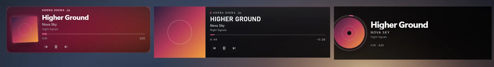
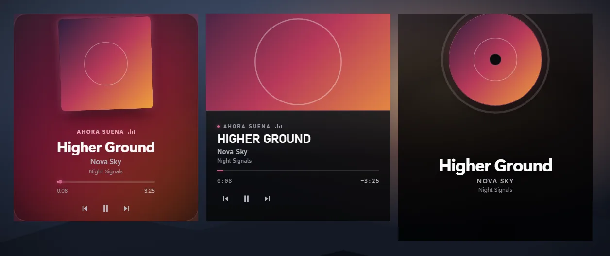
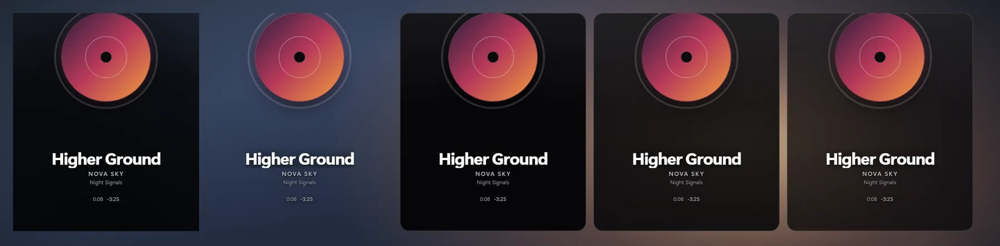
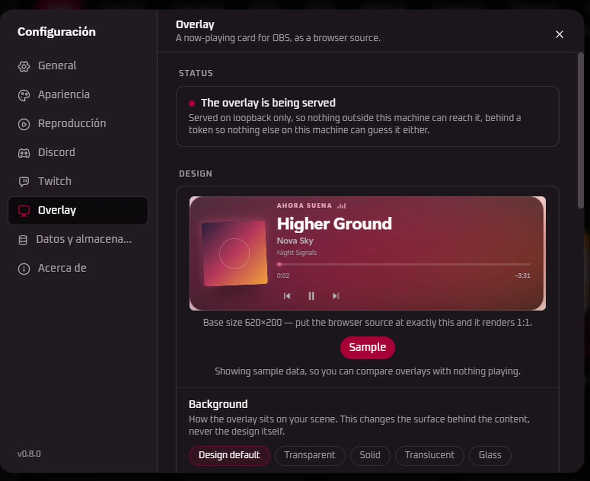
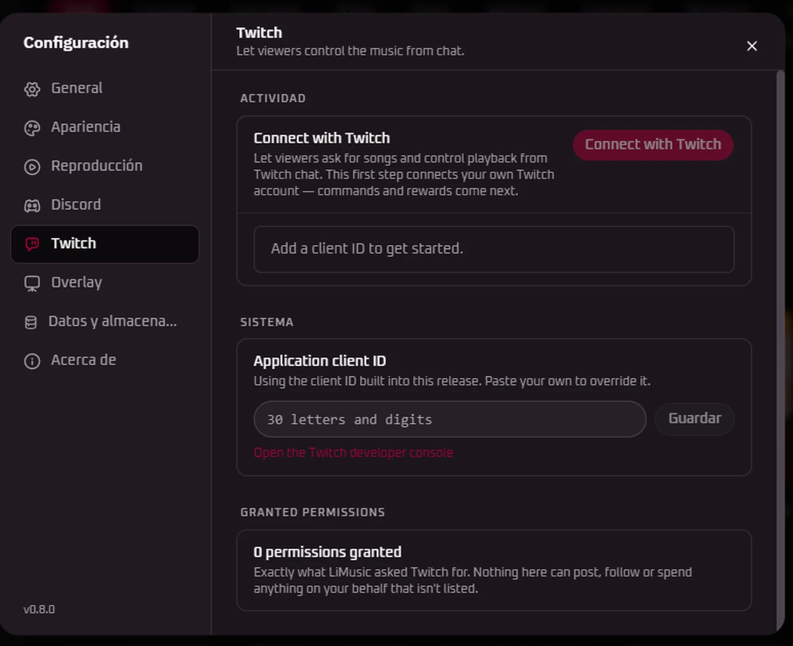

<div align="center">


# Limusic

**A native desktop YouTube Music client. Rust + Tauri, ad-free, no Electron.**

<p align="center">
  <a href="https://github.com/SimoHypers/limusic/releases/latest"></a>
  <a href="https://github.com/SimoHypers/limusic/releases/latest"></a>
  
  <a href="https://hosted.weblate.org/engage/limusic/"></a>
  <a href="https://simohypers.github.io/limusic/"></a>
  <a href="https://ko-fi.com/simohypers"></a>
  <br>
  
  
  
  
  
</p>

**Limusic** talks directly to YouTube's internal API and plays audio through libmpv: no bundled
browser runtime, no backend server, no ads in the audio. It started as a desktop rebuild of the
playback engine behind [Metrolist](https://github.com/mostafaalagamy/Metrolist), an Android
YouTube Music client, and grew from there.

> ### This is a fork
>
> It adds **Twitch integration** and an **OBS overlay system** on top of upstream `v0.7.3`.
> Everything below about the app itself is upstream's work and theirs to maintain — the original is
> [SimoHypers/limusic](https://github.com/SimoHypers/limusic).
>
> The download table further down describes *upstream's* artifacts. This fork publishes a
> **Windows x64 installer only**, unsigned and without updater artifacts:
> [Releases](https://github.com/tacosandtypescript-debug/limusic/releases).

</div>

---

## Features

- **Ad-free playback**: streams come straight from YouTube's API, ads never do
- **Search & browse**: songs, albums, artists, playlists and the YTM home feed, with results previewing as you type
- **Sign in** with your YouTube Music account: in-app Google login or cookie-paste, several accounts at once with switching between them
- **Your library**: playlists, liked songs, saved albums and artists, your uploads, and write actions (like, add to playlist, create/edit/delete playlists including cover art, subscribe, save to library)
- **History**: everything you have played, in YouTube Music's own day buckets
- **Gapless playback** with loudness normalization, powered by libmpv
- **Queue** with radio/automix continuation, drag to reorder, restored across restarts
- **Synced lyrics**: side panel with auto-scroll and click-to-jump, word by word where the source has the timings, with translations under each line
- **Music videos**: optional, the video plays where the artwork sits, with the same gapless audio behind it
- **Mini Player and theater mode**: shrink to a strip that keeps playing, or go fullscreen with cover and lyrics side by side
- **Local Music**: play your own files, with all metadata still intact
- **Last.fm scrobbling**: connect once from the title bar, every play is scrobbled
- **Discord Rich Presence**: artwork, live progress bar, one click to toggle
- **OS media keys** and now-playing integration (MPRIS on Linux, SMTC on Windows, plus playback buttons on the Windows taskbar preview)
- **System tray**: close the window, keep the music; play/pause and skip from the tray, optional start-on-login
- **Listen Together**: synced listening rooms over a small self-hosted relay
- **Keyboard and mouse**: `Ctrl+K` searches from anywhere, `Ctrl+H` lists every shortcut, right-click menus throughout, `Ctrl` and the wheel zooms the interface
- **Six languages**: English, Spanish, French, Turkish, Brazilian Portuguese and Indonesian, with more in progress
- **Self-updating builds** (AppImage on Linux, setup.exe on Windows, .app on macOS)
- **Make it yours**: accent palettes, custom colors, your own fonts, corner roundness, a custom app icon, and an adaptive theme that recolors the app from the playing cover
- **Twitch**: connect your own Twitch account from Settings, as the groundwork for viewers asking for songs from chat
- **OBS overlays**: six now-playing cards served over loopback, a copyable browser-source link, accents taken from the artwork, and four card backgrounds

---

## Screenshots

<table>
  <tr>
    <td></td>
    <td></td>
  </tr>
  <tr>
    <td></td>
    <td></td>
  </tr>
  <tr>
    <td colspan="2"></td>
  </tr>
</table>

---

<h2 align="center">Download & Install</h2>

<p align="center">
  <a href="https://github.com/SimoHypers/limusic/releases/latest">
    
  </a>
</p>

| Platform | File | Notes |
|---|---|---|
| Linux | `.AppImage` | Self-updating, libmpv bundled. Needs glibc 2.39+ (Ubuntu 24.04+, Debian 13+, Fedora 40+) |
| Linux (Ubuntu/Debian) | `.deb` | No self-update. Needs Ubuntu 24.04+ / Debian 13+; apt pulls libmpv and webkit2gtk in for you |
| Linux (Fedora/RHEL) | `.rpm` | Needs `mpv-libs` installed (`sudo dnf install mpv-libs`). Updates through dnf, not in-app |
| Linux (Arch) | [AUR](https://aur.archlinux.org/packages/limusic-bin) | `yay -S limusic-bin`. Community-maintained by [@xiryuudev](https://github.com/xiryuudev), updates through pacman |
| Windows | `-setup.exe` | Self-updating |
| Windows | `.msi` | Plain installer, no auto-update |
| macOS (Apple Silicon) | `.dmg` | Self-updating. Unsigned, so the first launch needs `xattr -dr com.apple.quarantine /Applications/limusic.app` |
| macOS (Intel) | none | Build from source, see [docs/BUILD-PLATFORMS.md](docs/BUILD-PLATFORMS.md) |

---

## Scrobbling & Discord

Both live in the title bar, next to the window controls.

- **Last.fm**: click the Last.fm mark, approve Limusic in the browser tab that
  opens, and you're connected for good. Tracks scrobble at the halfway point (or
  four minutes, whichever comes first), which is Last.fm's own rule. Click again
  to see the account or disconnect.
- **Discord**: click the Discord mark to toggle Rich Presence. Green dot means
  it's live. The card shows the track, artist, album art, and a progress bar, and
  it disappears when you pause.

Building from source? Last.fm needs your own API credentials, and they are not in
the repo. Get a key at [last.fm/api/account/create](https://www.last.fm/api/account/create)
and put it in `src-tauri/lastfm.keys`:

```
LIMUSIC_LASTFM_API_KEY=your_key
LIMUSIC_LASTFM_API_SECRET=your_secret
```

Without that file everything else still builds and runs; the Last.fm button just
reports that it isn't configured.

---

## OBS Overlays

Six now-playing cards, served by the app on loopback and dropped into OBS as a browser source. Each
one is a separate overlay with its own fixed composition: setting the source to the card's base size
renders it 1:1, and any other size scales the whole card proportionally rather than rearranging it.

<table>
  <tr>
    <td></td>
  </tr>
  <tr>
    <td></td>
    <td></td>
  </tr>
</table>

| Overlay | Base size | | Overlay | Base size |
|---|---|---|---|---|
| Sleeve · horizontal | 620 × 200 | | Sleeve · vertical | 380 × 430 |
| Playout · horizontal | 760 × 222 | | Playout · vertical | 380 × 430 |
| Vinyl · horizontal | 680 × 230 | | Vinyl · vertical | 400 × 470 |

- **The accent comes from the artwork.** The dominant colour is corrected into a band that stays
  legible on a dark card, and falls back to the design's own crimson when there is no cover or the
  canvas cannot be read.
- **Four backgrounds** — the design's own, transparent, solid, translucent or glass — plus presets,
  so the same overlay sits on gameplay, a bright title card, or footage in its own colours.
- **A sequenced track change**: the old content leaves, the artwork changes while it is invisible,
  and the new one arrives with an animation written for that design. The record winds down and back
  up instead of stopping dead.
- **Served on loopback behind a token**, so nothing outside the machine can reach it, and the cover
  proxy refuses any host but Google's image hosts over `https`.

Settings ▸ Overlay has a live preview, the copyable link and the OBS steps.



---

## Twitch

Connect your own Twitch account from Settings. This is the first step towards viewers asking for
songs and controlling playback from chat — the connection is here, the commands are not yet.



- **Device Code Grant**: no client secret and no redirect URI, so there is nothing to register beyond
  a client ID. A revoke from Twitch's side is picked up rather than ignored.
- **EventSub over WebSocket**, with keepalive, reconnect with backoff, and dedupe by message id, so a
  dropped connection says why and a repeated message is only acted on once.
- **The panel lists exactly which permissions were granted**, so it is visible what LiMusic can and
  cannot do on your behalf.
- **Bring your own client ID** — paste one in Settings to override the one built into the release.

**Not in yet**: chat commands (`!song`, `!skip`, `!play`, `!queue`, `!remove`, `!volume`),
channel-point rewards, permissions, cooldowns, and the separate request queue. The plumbing is
there; nothing listens to chat.

---

## Lyrics

Open the panel with the microphone button in the player bar, next to the queue
button. It takes the same side of the window as the queue, so opening one closes
the other.

Lyrics come from [Boidu](https://boidu.dev) first, then
[LRCLIB](https://lrclib.net), then YouTube Music's own timed lyrics, then
Netease, QQ Music and Kugou, falling back to plain un-timed text when nobody has
a synced version. Matching is keyed on the track's exact length, because popular
songs exist as several cuts and the wrong one drifts a few seconds out. Results
are cached locally, so replaying a track is instant.

Boidu is the only source with per-word timings, which is what lets a line
highlight word by word as it's sung. It goes first for that reason, which also
means it is asked about every track you play. Turn it off in **Settings ->
Playback -> Word-by-word lyrics** and the other sources still provide
line-by-line lyrics. Netease additionally supplies translations, shown under
each line where it has them.

Note that YouTube Music's lyrics are licensed per region and are missing
entirely in some countries. Where that's the case, LRCLIB does all the work.

---

## Listen Together

Synced listening with friends. Everyone streams their own audio from YouTube;
the room only relays play/pause, seeks, track changes and the queue. One person
hosts the relay:

```bash
cargo run -p sync-server        # plain WebSocket on 0.0.0.0:8080
```

Front it with something that terminates TLS (Tailscale Funnel, Cloudflare
Tunnel), then paste the `wss://` URL into the Listen Together panel in the app.
Rooms have join codes and the host approves every join and every track
suggestion.

---

## Translations

Limusic is translated on [Weblate](https://hosted.weblate.org/engage/limusic/),
who host it free for libre projects.

<a href="https://hosted.weblate.org/engage/limusic/">
  
</a>

English, Spanish, French, Turkish, Brazilian Portuguese and Indonesian ship in
the app today.
The badge above shows everything else in flight.

**Translate on Weblate, not in a pull request.** Weblate keeps its own copy of
the catalogs, so a hand-edited `fr.json` merged here puts the two out of sync
and the next batch of real translations arrives as a merge conflict. Weblate
also shows you the English original beside each string, flags translations that
went stale when the English changed, checks that placeholders like `{count}`
survived, and opens the pull request for you. Anything untranslated falls back
to English in the app, so partial work is safe to submit.

`en.json` is the exception: it changes by hand, in whichever pull request
changes the UI. Switching a finished language on in the picker takes a small
code change too, see [CONTRIBUTING.md](CONTRIBUTING.md#translations).

---

## Building from Source

Fedora:

```bash
sudo dnf install mpv-libs mpv-libs-devel webkit2gtk4.1-devel \
  gcc gcc-c++ make openssl-devel librsvg2-devel
cd ui && pnpm install && cd ..
cargo tauri build
```

Windows and macOS instructions live in [docs/BUILD-PLATFORMS.md](docs/BUILD-PLATFORMS.md).

---

## How It Works, Briefly

- A pure Rust crate speaks YouTube's InnerTube API, impersonating several
  official client identities and falling back between them when one fails.
- YouTube's stream URLs are protected by obfuscated JavaScript (the signature
  cipher and the `n` parameter) and by BotGuard attestation. Limusic runs that
  JavaScript where it expects to run, in a real webview, hidden, and never lets
  any of it touch the UI process.
- Audio goes through libmpv: gapless transitions, an on-disk cache, and
  loudness normalization from YouTube's own metadata.
- The UI is a SvelteKit SPA that only ever talks to the Rust core. It never
  contacts YouTube itself.

---

## Star History

<a href="https://www.star-history.com/?repos=simohypers%2Flimusic&type=date&legend=top-left">
 <picture>
   <source media="(prefers-color-scheme: dark)" srcset="https://api.star-history.com/chart?repos=simohypers/limusic&type=date&theme=dark&legend=top-left" />
   <source media="(prefers-color-scheme: light)" srcset="https://api.star-history.com/chart?repos=simohypers/limusic&type=date&legend=top-left" />
   
 </picture>
</a>

---

## Support

Limusic is free and stays free. If it earned a coffee,
[ko-fi.com/simohypers](https://ko-fi.com/simohypers) is where to leave one.

---

## Disclaimer

This project is not affiliated with, funded, authorized, endorsed by, or in
any way associated with YouTube, Google LLC, or any of their affiliates and
subsidiaries.

All trademarks, service marks, and intellectual property rights referenced in
this project belong to their respective owners.

---

## License

[GPL-3.0](LICENSE)
